# 数据库系统 & 数据挖掘 

---

## 数据库系统体系结构

### 并行系统

并行系统通过并行地使用多个处理器和磁盘来提高处理器和I/O速度。

#### 并行数据库体系结构

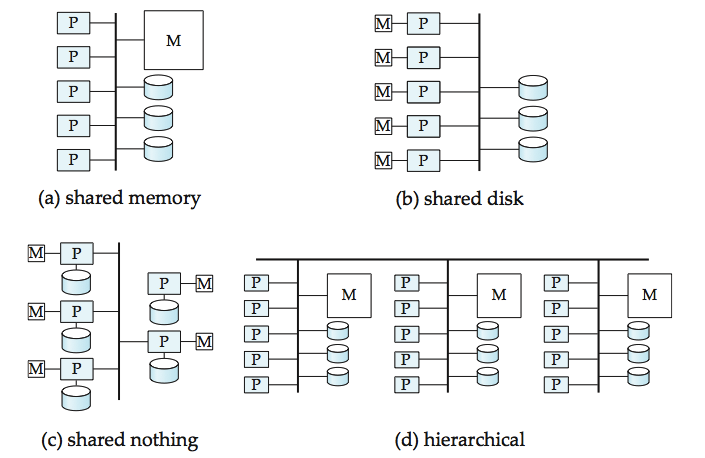

主要结构如图，分析优缺点可以从处理器通信复杂性、数据共享复杂性、可拓展性（涉及硬件基本工作方式）来讨论。

- 共享内存

	共享内存体系结构中，处理器和磁盘通过总线或互连网络来访问一个公共的主存储器。
	
	优点：
	
	1. 通过内存方式，原本运行在多个独立处理器中的进程通信会很快。
	
	2. 共享内存中的数据可以被所有处理器直接访问到，不需要通过软件来移动，数据共享快。
	
	
	缺点：
	
	1. 所有存取都通过同一个存储器，存储器总线压力很大。
	
	2. 共享总线的方式使得多个CPU竞争使用，等待总线时间长。增加太多节点反而性能会下降，拓展性不好。

- 共享硬盘

	共享硬盘模型中，所有磁盘通过互联网络直接访问所有磁盘，但每个处理器有自己独立的内存。
	
	优点：
	
	1. 存储器总线的压力相比共享内存会小很多，不再是瓶颈。
	
	2. 以较经济方式提供了具有一定容错性的系统，数据库驻留在磁盘上，所有的处理器都可以访问共享的磁盘信息，当其中某个处理器发生故障时，别的处理器可以替代它。
	
	缺点：
	
	1. 依旧需要共享互连系统，磁盘访问压力很大。

	2. 各个处理器间通信需要经过共享网络，通信开销大。不能扩展太多节点，拓展性一般。

- 无共享

	机器的每个节点包括一个处理器、一个内存和磁盘。节点上的每个设备可以通过高速互连的网络与另一个节点上的处理器通信。一个节点作为该节点所拥有磁盘的服务器来运行。
	
	优点： 
	
	1. 所有的节点都可以作为独立的数据库系统运行，可以克服共享式系统对于总线、内存、磁盘访问的冲突问题。
	
	2. 只有极少需要访问别的节点磁盘数据时才需要网络传送，通常节点越多效率越高，可扩展性好。
	
	缺点：
	
	1. 访问非本地数据及处理器间通信代价大，因为数据的传输涉及两端的软件交互。
	

- 层次的

	综合了以上三种结构的特点，宏观上看相当于多个共享内存系统结构作为子系统的网络互连。

### 分布式系统

分布式系统中，数据被存储在几台计算机中，分布式系统中的计算机通过高速私有网络或因特网那样的通信媒介相互通信，他们不共享主存或磁盘。为了区分，我们把分布式系统中每一个带有独立处理器、磁盘、存储器的计算机称为站点。分布式系统的描述和并行系统中无共享模式很相似，但也有一些区别。首先，分布式系统的各个站点在地理上是分离的，可以分别进行管理，互连速度也比较低。另一方面，分布式系统中事务分为局部事务和全局事务，局部事务仅仅访问本站点数据，而全局事务可能会涉及到分布式系统中一个或多个其它站点上的数据。

分布式系统主要有以下几个特点：

1. 数据共享：

	分布式系统中多个站点的数据是可以共享的，一个站点除了自身数据外还可以访问其他站点数据，扩展了对单个站点数据。
	
2. 自治性：

	自治性表示各个独立的站点可以对本地存储的数据进行一定程度的控制。在分布式系统中有一个全局数据库管理员负责管理整个系统，不过有一部分职责被委派给每个站点的本地数据库管理员，每个本地数据库管理员都可以有不同程度的局部自治能力。
	
3. 可用性：

	分布式系统中各个站点除了保存自身数据外，还可以复制该系统其他站点的数据，这就使得当某个站点发生故障时，可以通过别的站点找到相应数据而不用停下整个系统，这也是分布式系统一个很大的优势。不过故障站点在故障恢复后，还需要平滑地加入到原系统中，这恢复的过程将比单系统困难不少。
	
在一个理想化的模型中，分布式系统中各个站点不仅运行相同的数据库管理系统，而且可以彼此互相知道对方的存在。但大部分情况下，分布式系统是通过连接多个已存在的数据库系统来构造的，这就导致每个数据库都有自己模式且运行不同的数据库管理软件，这就涉及异构分布式数据库系统的管理的问题了。

在一个全局事务中，一个事务需要在两个站点上运行，如果一个站点提交而另一个站点终止，则会导致状态的不一致，为了确保这种不一致性不会发生，两阶段提交协议（2PC）是应用最广泛的协议。

并发控制是另一个值得考虑的问题，如果使用锁机制，则当其它站点请求被上了锁的数据就会等待，甚至会因为锁的顺序问题导致死锁。在操作系统中我们层学过死锁检测的相关问题，不过在分布式系统中死锁检测会更加困难，因为死锁跨越多个站点。

另外，分布式数据库也更容易发生故障，除了站点本身故障外，链路通信故障也常会发生，在发生故障时，数据复制和故障恢复就显得格外重要。不过数据复制和恢复又给并发控制带来了困难，这也是分布式系统中需要研究的重点之一。

---

## 分布式数据库

### 提交协议

如果要保证原子性，执行事务就必须保证所有执行了事务T的站点的最终结果上达成一致。T要么做到在所有站点上都提交，要么在所有站点上都中止。为了保证这一特性，T的事务协调器必须执行一个提交协议。

#### 分布式事务系统结构

每个站点都有自身的局部事务管理器，其功能是为了保证在本站点上执行事务的ACID特性。各个事务管理器相互协作以执行全局事务。通常一个事务系统是的抽象模型，每个站点包括两个子系统：

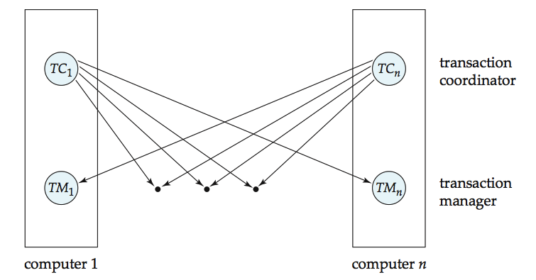

- 事务管理器

	事务管理器管理那些数据存储在一个站点的局部事务的执行，这些事务既可以是局部事务也可以是全部事务的一部分。事务管理器负责：
	
	- 维护用于恢复目的的日志。
	
	- 参与到合适的并发方法中。
	

- 事务协调器

	协调各站点上发起的各个事务的执行。协调器主要负责：
	
	- 启动事务的执行。
	
	- 将事务分成子事务，并将事务分派出去。
	
	- 协调事务的中止。

#### 两阶段提交(2PC)

##### 提交协议

为了保证原子性，执行事务T的所有站点必须在执行的最终结果上保证一致性。T必须保证要么所有站点上都提交要么所有站点上都中止。

考虑从站点Si发起的事务T，设Si的事务协调器是Ci。假设此时T完成其执行阶段（参与T的所有站点都通知Ci都已完成T的执行），Ci执行2PC协议。

1. 阶段一：

	- 发起方：
	
	  Ci将记录**prepare T**加入日志中，并强制写入稳定存储器上。接着将**prepare T**消息发送到执行的所有站点上。
	  
	- 执行方：
	
	  确定是否愿意提交T中属于它的那部分。
	  
	  - "Yes"
	  
	  	事务管理器将**ready T**加到日志中，将日志强制写入稳定的存储器上，然后向事务管理器Ci回复**ready T**消息作为回答。
	  	
	  - "No"
	  
	  	事务管理器将**no T**加到日志中，向Ci发送**abort T**消息作为响应。
	
2. 阶段二： 

	- 发起方：
	
		发起方通过其他所有站点对**prepare T**消息的反馈信息，或者设定定时器来完成对事务T提交与否的最终决策。
		
		- Ci收到所有站点的**ready T**应答
		
			事务T可以提交，将**commit T**写入日志并强制写入稳定存储器，之后向所有站点发送**commit T**消息。
		- Ci未能收到所有站点的**ready T**应答
		
			事务T被中止，将**abort T**写入日志并强制写入稳定存储器，之后向所有站点发送**abort T**消息。

	- 执行方：
	
		接收到发起方的消息后，将消息写入日志中。
		
在第一阶段执行方发送**ready T**消息之前，执行方可以无条件中止T，但一旦提交了**ready T**消息之后，就需要遵守承诺，按照协调器命令来提交或者中止T。因此，所有的信息必须稳定的存储器中，否则一旦发送了**ready T**之后崩溃，就不能兑现自己的承诺。进而言之，事务所拥有的锁必须继续保留直到事务结束。

按照上面的思想，实际上当只有一个执行站点回复了**abort T**消息，实际上就已经决定了最后的结果。因为发起方也属于执行站点之一，所以协调器可以单方面中止最后的提交。提交的最终结果在写入日志并且强制写入稳定存储器后才算完成。

##### 故障处理

2PC协议对于两类不同故障有不同的反应。

###### 执行方（参与站）故障

- 发起站：

	发起站检测到如果是在执行方第一阶段应答前发生的，则默认收到了**abort T**回答的，实际上最终结果一定是**abort T**的。
	
	如果是在收到消息之后，则按照正常方式执行剩余部分（包括向故障站点发送最终结果）。
	
- 执行方：

	等故障站点Sk恢复之后，故障站点通过检查日志来决定接下来的工作。
	
	- 包含**commit T**或者**abort T**记录：
	
		说明收到了最终执行结果，根据信息完成或者中止本机接下来是redo(T)还是undo(T)。
		
	- 包含**ready T**：
	
		此时不能保证别的站点是否提交了**abort T**从而中止了操作，所以需要去询问协调器Ci。
		- Ci在工作：
			
		    反馈给Sk信息，之后根据反馈决定接下来步骤。
			
		- Ci不在工作：
		
			试图通过**querystatus T**消息从其它站点得到信息并做出决策。
		
	- 包含**abort T**：
	
		undo(T)。

	- 不含以上信息：
	
		说明在发送消息前已经故障，但是由于Ci默认收到了**abort T**反馈，所以默认是中止操作的，所以此时Sk执行undo(T)。
		
###### 发起方（协调器）故障：

如果协调器发生了故障，某些就必须由参与站点来决定最终的提交结果。

- 活跃站点日志中有**abort T**或者**commit T**记录：

	按照日志内容提交或或中止。
	
- 活跃站点中没有**ready T**记录：

	中止T。
	
- 活跃站点中有**ready T**记录：

	此时不等到协调器Ci回复就没法做出决定，所以所有的活跃站点必须等待Ci恢复。如果使用锁，T可能拥有活跃数据上的锁，导致数据不可用，其它事务也可能被迫等待T，造成阻塞现象。
	
2PC的主要缺陷也就在于协调器故障可能导致阻塞。

### 分布式数据库中的并发控制

#### 单一锁管理方式

系统维护位于单个选定站点Si中的单一锁管理器。所有封锁和解锁都在这个节点上处理。

- 优点：

	- 实现简单。无论解锁或者封锁都只需要向处理节点发送消息即可。
	
	- 死锁处理简单。所有处理在同一站点上，所以可以简化很多问题

- 缺点：

 	- 瓶颈。Si负责所有的操作，所有请求都必须在这里处理。
 	
 	- 脆弱性。一旦Si出现故障，就会丢失整个并发控制器，并发执行几乎瘫痪。

#### 分布式锁管理器

##### 未复制情况

该方案中封锁管理器分布在多个站点上。每个锁管理器管理本地数据，假设请求的数据存储在Si上，因为数据并为复制，此时本地锁仅仅管理本地的数据。当有节点请求该数据时，仅需要向存有该数据的站点的锁管理器发送请求消息即可，具体封锁解锁操作由各自锁管理器决定。

##### 数据项复制情况

###### 主副本

这种模式在多个复制了数据的站点中选择一个站点的副本作为主副本。对于数据Q而言，Q的主副本必须完全位于同一个站点上。在有事务请求需要封锁Q时，要对主副本所在的站点请求封锁。请求的响应会推迟到该请求能被满足为止。

- 优点：

	使得已复制数据的并发控制就像处理未复制数据一样。
	
- 缺点：

	一旦主副本所在站点发生故障，则即使其他站点Q数据可以被访问，在这种情况下也不能被访问了。

###### 多数协议

如果数据项Q在n个不同的站点上复制，则封锁请求消息必须发送到Q的n个站点中一半以上的站点，每个锁管理器可以决定锁能够授予。

- 优点：
	
	- 能够解决单个站点故障带来的问题。
	
	- 能够分散地处理请求。
	
- 缺点：

	- 实现上更复杂，封锁请求至少需要2•(n/2 + 1)条消息来处理请求，解锁请求至少需要(n/2 + 1)条消息。
	
	- 容易产生全局死锁问题。即使一个数据项被封锁也可能发生死锁。
	
	- 死锁处理复杂。

###### 有偏协议

与多数协议主要区别就是对共享锁请求的待遇比排他锁请求要优越一些。

共享锁：当事务需要封锁数据项Q时，只需要向包含Q的副本的一个站点上的锁管理器发起锁请求即可。

排他锁：当事务需要封锁数据项Q时，要向包含Q副本的所有站点上的锁管理器发起锁请求。

- 优点： 

	- 相比多数协议，有偏协议大大减少了read操作的开销，而通常read频率要高于write操作。

- 缺点：

	- 增加了write操作的复杂度。
	
	- 死锁处理复杂。
	
###### 法定人数同意协议

给每个站点分配权重，为数据x上的读写分配两个整数，称为读法定人数Qr和写法定人数Qw，它们必须满足条件，其中S是x所在所有站点的总权重：

- Qr+Qw > S 且 2•Qw > S

为了执行读操作，必须封锁足够副本，使他们的总权重至少是r。为了执行写操作，必须封锁足够副本，使他们的总权重至少是w。

- 优点：

	选择性地降低读或写的封锁代价。
	
### 分布式查询处理

分布式系统中，查询处理必须考虑几个因素：

- 数据在网络上的传输代价。

- 几个站点并行处理性能上的提升。

#### 形式化查询语言

##### 关系代数

###### 基本运算

- 选择(σ)、投影(π)、并(∪)、集合差(-)、笛卡尔积(×)和更名。

谓词：

- =、﹥、≧、﹤、≦、≠。

连词：

- and、or、not。

其中，选择操作对应于关系在水平方向上满足给定谓词的元组。投影对应列出列向上特定属性的元素。并运算在这里表示多个同类集合的并。

举个例子：

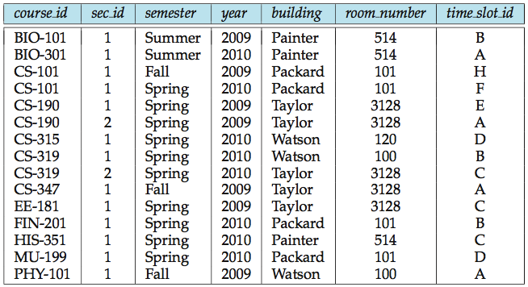

- πcourse_id( σsemester='Fall' and year=2009)(section) ∪ πcourse_id(σsemester='Spring' and year=2010)(section) )

	该例表示在关系表section中选择出semester为Fall，year为2009的元组以及semester为Spring，year为2010的元组，将二者所有选出的集合做并。之后在这个并起的元组中列出所有course_id列。最终得到的结果仅有一列course_id。

相容性原则：	

- 用来做并运算的关系r和为了保证结果是有意义的，必须满足下列两个条件：

	- 关系r和s必须是同元的，即它们的属性数目必须相同。

	- 对所有的i，r的第i个属性和s的第i个属性必须相同。

这个准则同样适用于集合差运算，集合差r-s表示包含在r中而不包含在s中的元组的关系。

笛卡尔积运算用于将两个关系组合在一起，记作r×s。笛卡尔积中包含了所有可能的由一个来自r中的元组和一个来自s中的元组构成的元组对（每从r中取出一个元组都要和s中所有元组配对）。如果r中有n1个元组，s中有n2个元组，则最终结果包含n1•n2个元组，通常我们说的关系就是一组域上笛卡尔积的子集。

总结以上，下面列出的是最后基本的关系代数表达式：

- E1 ∪ E2

- E1 - E2

- E1 × E2

- σp(E1)

- πs(E1)

###### 附加关系代数运算

1. 自然连接（⋈）：

	在进行笛卡尔积时通常涉及选择运算，比如最终得到的结果中，两个关系的某个属性值（通常是主键）必须相同才会被选出。将做笛卡尔积和选择两个步骤和并为一个运算，用连接（⋈）表示它。

	自然连接运算首先形成它的两个参数的笛卡尔积，然后基于两个关系模式中都出现的属性上的相等性进行选择元组，最后还要去除重复的属性，只保留其中一个。所以自然连接既涉及行（元组）选择又包含列（属性）选择。

	则可以用下面这个形式化定义自然连接：

	- r⋈s=πR∪S(σr.A1=s.A1 and …… and r.An=s.An(r×s))

	当然，如果r和s不包含任何属性，则r⋈s=r×s。
	
2. 赋值运算（←）：

	通过给临时关系变量赋值的方法来写关系代数表达式。赋值用←表示。比如上面自然连接运算可以写成：
	
	- temp1 ← r×s	
	- temp2 ← σr.A1=s.A1 and …… and r.An=s.An(temp1)	
	- result = πR∪S(temp2)
	
3. 外连接运算：

	连接运算扩展，这里就不展开了。

#### 简单的连接处理

计算表达式r1⋈r2，其中r1和r2分别存储在站点S1和S2上。有两种可选策略：

1. 将r2从S2</sub发送到S1，之后在S1上计算自然连接。

2. 将r1从S1</sub发送到S2，之后在S2上计算自然连接，之后将得到的结果重新传回S1站点。

显然，第二种方式的传输开销更大。不过，第一种方式仍有改进空间。

#### 半连接策略

假设我们希望计算表达式r1⋈r2，其中r1和r2分别存储在站点S1和S2上。令r1和r2的模式分别为R1和R2，希望在站点S1得到结果。

如果r2中有许多元组不能和r1中任何元组相连，那么把r2送到S1就必须传送那些对结果无贡献的元组，我们希望在传送到S1前就能去掉这样的元组。

一种可能的策略是：

- 在S1计算temp1 ← πR1 and R2 (r1)

- 将temp1从S1传到S2

- 在S2计算temp2 ← r2⋈temp1

- 将temp2送S2传到S1

- 在S1计算r1⋈temp2。产生的关系和r1⋈r2相同。

	当r中有较少元组对连接有贡献时（即temp2中元组数远远小于r2时），这种策略优势明显，此时只需将temp2而不是r2全部送到S1。而这种策略额外增加的开销是将temp1送到S2。如果r2对连接的贡献足够小，就能在即使有额外开销的基础上也能节省下总开销。
	
	以上这种策略叫做半连接策略，r1和r2的半连接计为r1⋉r2。即：
	
	- πR1(r1⋈r2)
	
	在第一步中，通过r1⋉r2选出了r1中对r1⋈r2有贡献的那些元组，在第三步中，temp2=r2⋉r2，选出了r2中对r1⋈r2有贡献的那些元组。
	
	对于具有多个关系的连接来说，也可以分拆成多个半连接策略来实现，从而减少额外开销。
	
#### 利用并行性的连接策略

假设有4个关系的连接：

- r1⋈r2⋈r3⋈r4

其中ri存储在Si上。可以先将r1从S1送到S2计算r1⋈r2，同时将r3从S3送到S4计算r3⋈r4。在计算r1⋈r2的过程中将已经计算好的元组发送到S1，而不用等全部连接计算完成。另一边的S4也是同理。

一旦r1⋈r2和r3⋈r4到达S1就可以开始计算(r1⋈r2)⋈(r3⋈r4)。因此，S1上的结果可以同S2和S4的计算并行进行。

---

## 数据预处理

要经过数据清理、数据集成、数据规约和数据变换与数据离散化等步骤。

---

## 数据仓库和联机分析处理
### 数据仓库

数据仓库是一个从多个数据源收集的信息存储库，存放在统一模式下，并且通常驻留在单个站点上。数据仓库通过数据清理、数据变换、数据集成、数据装入和定期数据刷新来构造。

通常，数据仓库用数据立方体的多维数据结构建模，每个维对应于模式中一个或一组属性，每个单元存放某种聚集度量值（比如数据立方体三个维度分别为季度、城市和类型，每个季度的值为该季度下各月份之和，只不过在这个视图下并不能直接看到各个月的数据。如果要详细显示各个月数据，需要通过下面介绍的下钻来实现）。

#### 联机分析处理（OLAP）

首先比较一下数据库系统操作和数据仓库操作的区别。数据库操作对应的是OLTP系统，主要任务是执行联机事务和查询处理。数据仓库操作对应的是OLAP系统，只要任务是执行数据的分析和决策。二者更细致的对比如下：

1. 用户和系统的面向性：

	OLTP面向顾客，提供事务和查询业务。OLAP面向市场，主要用于数据分析。
	
2. 数据内容：

	OLTP管理当前数据，数据比较琐碎，不利于决策。OLAP管理历史数据，且数据比较规整，利于有根据的决策。
	
3. 数据库设计：

	OLTP采用实体-联系模型和面向应用的数据库设计。OLAP采用星状或雪花状模型，面向主题设计。
	
4. 视图：

	OLTP一般仅涉及本单位内数据，不涉及历史数据和不同单位数据。OLAP由多个单位的数据库历史信息集成而成。
	
5. 访问模式：

	OLTP系统的访问主要由短的原子事务组成，主要关注点在并发控制和恢复机制上。OLAP的访问基本都是只读操作。

正因上述这些不同，所以在进行数据挖掘时要额外构建数据仓库。OLAP操作主要是对数据进行查询操作，而一般的操作数据库是分离的，这样查询效率会比较低，影响OLAP效率。另一方面，OLAP仅涉及数据的大量访问，如果把并发控制和恢复机制也给OLAP使用的话，也会影响OLTP的吞吐量。最后，也是因为二者维护数据的差别，导致OLAP操作所需的历史数据在操作数据库中不能得到，所以数据挖掘前首先需要建立独立的数据仓库。

##### 数据立方体

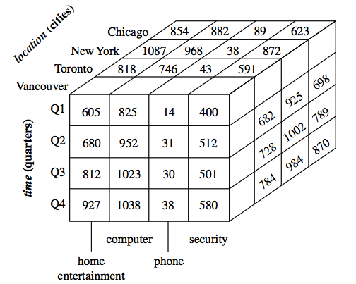

在描述OLAP基本操作前，首先需要简单介绍一下数据立方体。数据立方体的每个维度表示一个相应的属性，每个维可以有一张与之关联的维表，为了描述维表，每个维表可以包含多个属性。比如上图中，立方体的三个维度分别是time, item和location。

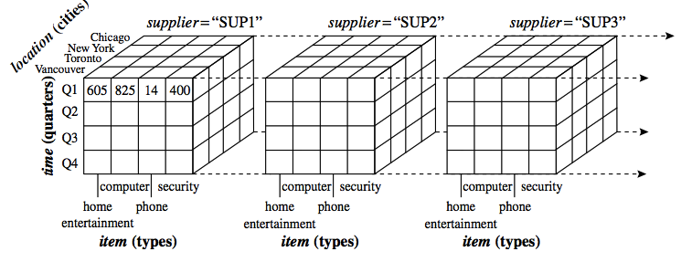

当然，维度不仅仅只是三维的，不过只要记住n+1维的立方体是由n维的序列组成就比较容易理解这个问题了，上图展示了四维情况下（多了supplier维）数据立方体的表示。

##### 多维数据模型

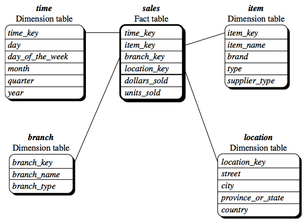

星形模型：包含一个中心表（事实表）和一组小的附属表（维表）。其中中心表中的数据不包含冗余，中心表包含多个维标识符，每个标识符对应一张维表，而在维表中则是可以有冗余信息的。

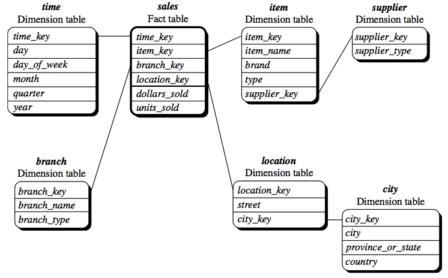

雪花模型：雪花模型相比于星型模型，最主要的区别在于对某些维表进行了规范化，简而言之就是通过二级维表来存储原先全部存储在维表中的内容，这么做的目的是为了防止数据冗余，比如原本location维表中存储有大量具有相同(city, state, country)的数据，通过这种存储方式只需要存储一份即可，其他相同的维表通过city_key进行共享即可。

- 优点：

	去除冗余，易于维护。

- 缺点：

	查询操作需要连接，降低浏览效率。
	
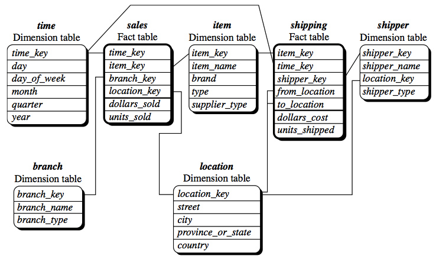

事实星座：事实星座模型相比于星形模型最大的区别在于拥有多个事实表（中心表），并且多个事实表可以共享维表，例如上例中两个事实表scales和shipping就共享维表time, item和location维表。

##### OLAP基本操作

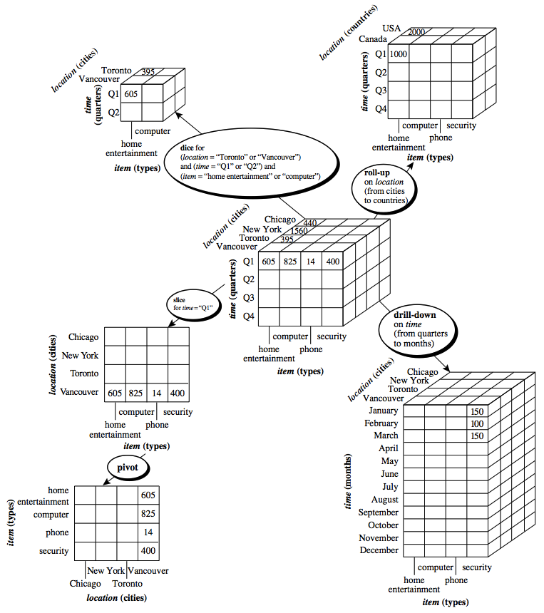

1. 上卷（roll-up）

	通过沿一个维的概念分层向上攀升或者通过维规约在数据立方体上进行聚集。如location层被定义为全序street<city<province<country，对city做上卷操作，将会由city层向上到country层聚集数据，结果立方体按country而不是对city对数据分组，简单来说就是对某维度上几个具有相似属性的值进行聚集形成新的数据，并赋予更高级的概念。
	
2. 下钻（drill-down）

	下钻由不太详细的数据到更详细的数据。下钻可以沿维的概念分层向下或引入附加的维来实现，结果数据立方体会列出更为具体的数据分组。对某个维度进行下钻处理，简单来说就是保持其他维度不变情况下对进行下钻的这个维度数据进行展开，以显示数据聚集前原本各个分量的值。
	
3. 切片（slice）

	在给定的数据立方体的一个维上进行选择，导出一个子立方体。被选择的维上只有特定一种属性。

4. 切块（dice） 

	在两个或者多个维上进行选择，定义子立方体。

5. 转轴（pivot）

	转轴是一种目视操作，提供数据的替代表示。
	
---

## 挖掘频繁模式、关联和相关性

频繁模式是频繁地出现在数据集中的模式，频繁地出现在交易数据集中的商品的集合是频繁项集。如果一个子结构频繁地出现，则称它为结构模式。对于数据挖掘之间的关联。相关性和许多其他有趣的联系，发现这种频繁模式起着至关重要的作用。

下面简单介绍一下常见术语。项的集合称为项集，包含k个项的项集称为k项集。项集的出现频度是包含项集的事务数，简称为项集的频度、支持度计数或计数。如果项集I满足预定义的最小支持度阀值（即I的绝对支持度满足对应的最小支持度计数阀值），则I为频繁项集。频繁k项集的集合通常计为Lk。

通常数据的关联性大部分用于寻找数据间的潜在联系，举个最简单的例子就是商品推荐。

1. 单维关联规则：

	- buys(X, "computer") -> buys(X, "software")[support = 1%, confidence = 50%]
	
		其中顾客表示X，confidence = 50%表示置信度（购买了电脑的顾客中又购买了软件的比例），support = 1%表示支持度（在所有的事务中，电脑与软件一同购买的比例）。因为这个关联规则仅仅涉及单个重复的谓词buys，所以称为单维关联规则。
		
2. 多维关联规则：

	- age(X, 29) Λ income(X, 40K……49K) -> buys(X, "laptop")[support = 2%, confidence = 60%]
	
		其他意义同上，但这里使用了三个谓age, income和buys的关联，每个属性称作一个维，上面的规则可以称为多维关联规则。
		
有些关联规则会被认为是无意义的而被丢弃，比如它不能同时满足最小支持度阀值和最小置信度阀值。当然，这里支持度的计量单位不一定是按照上面列出的比例模式，有些地方支持度也可以通过出现的次数来代替，比如下面举的例子中，支持度就是通过出现次数来计算的。

### 关联规则

一般而言，关联规则的挖掘是一个两步的过程：

1. 找出所有的频繁项集：

	这些项集的每一个频繁出现次数至少与预定义的最小支持计数min_sup一样。

2. 由频繁项集产生强关联规则：

	这些规则必须满足最小支持度和最小置信度。
	
由于第二步开销远低于第一步，所以挖掘关联规则的总体性能由第一步决定。另外，在后面的例子中也将看到，大型数据库中主要挑战是，这种方式常会产生大量满足最小支持度阀值的项集，当min_sup（最小支持度阀值）较低时尤其如此，所以项集的数量会非常巨大，因此引入了闭频繁项集和极大频繁项集两个概念，不过这里不会展开去说。上面已经说到，在找到关联规则，首先需要找出所有的频繁项集，最简单的挖掘频繁项集的方法便是Apriori算法。

#### Apriori算法

Apriori是一种发现频繁项集的基本算法，它使用一种称为逐层搜索的迭代方法，其中k项集用于搜索(k + 1)项集。扫描数据库，累计每个项的计数，并收集最小支持度的项，找出频繁1项集的集合，计为L1。然后，使用L1找出频繁2项集的集合L2……如此下去，直到不能找到频繁k项集，找出每个Lk需要一次数据库的完整扫描。

为了提高频繁项逐层差产生的效率，需要用到先验性质来减少搜索次数：频繁项的所有非空子集也一定是频繁项。

先验性质的使用需要通过下面两个步骤来实现：

1. 连接步：

	为了找出Lk，通过将Lk-1与自身连接产生候选k项集的集合，计为Ck。
	
2. 剪枝步：

	Ck是Lk的超集，也就是说在Ck中的项集是频繁k项集Lk的超集。可以通过比较Ck中的计数和最小支持度计数大小来去除所有不属于Lk中的集合。但是由于Ck可能很大，所以时间复杂度依旧非常可观，这就需要我们事先对Ck进行减枝。根据先验性质，如果Ck的任何(k - 1)项子集不在Lk-1中，则该候选也不会是频繁的，从而从Ck中删去，以减少计算量。
	
下面以一个例子来说明Apriori算法。

 

具体过程将配合下图进行讲解，假设该例中最小支持度计数为2。

1. 第一次迭代时，所有候选项都是候选1项集的集合C1的成员，算法简单统计每个项的出现次数。

2. 将C1表计数列数值逐个与最小支持度计数比较，因均>=2，所以L1和C1相同。

3. L1作自身连接得到C2。

4. 因L1包含所有元素，所以先验性质并未在此步剪枝。

5. 统计每项次数。

6. 将C2中各个元素次数与最小支持度计数比较，删除小于最小支持度计数的元素，得到L2。

7. L2作自身连接得到C3。

8. C3 = {{I1, I2, I3}, {I1, I2, I5}, {I1, I3, I5}, {I2, I3, I4}, {I2, I3, I5}, {I2, I4, I5}}，因为若要成为频繁项集的子项都必须全是频繁子项，所以上述所有集合的子集合若不能全部出现在L2中则要删除。（例：L2中不包含{I3, I5}，所以C3中{I1, I3, I5}元素删去）。剪枝后仅有两个集合元素。

9. 统计每项的次数。

10. 与最小支持度计数比较，删除不符合的元素。

11. 重复上面的操作，得到C4 = {I1, I2, I3, I5}，因为其子集{I2, I3, I5}不是频繁的，所以C4为空，算法终止，找出了所有频繁项集。

不过Apriori算法虽然实现简单，但是可能需要产生大量候选项集并且可能需要重复地扫描数据库。

#### 由频繁项集产生关联规则

得到了频繁项集就可以直接用来产生强关联规则。

只有同时满足最小支持度和最小置信度才能叫做强关联规则。我们可以简单理解A->B是强关联规则表示在A事件成立的条件下B发生的概率要达到我们之前设定的阀值（最小支持度和最小置信度）。

关联规则实际上是将我们之前得到的频繁项集划分成两个子集合A、B，其中A U B = Lk。

之前先验规则一就能够保证了Lk的任何子集一定是满足最小支持度的，所以我们仅仅需要验证confidence(A->B)满足最小置信度即可保证是强关联规则。

通过下式子计算A->B的置信度。

所以，我们将产生关联规则的全过程总结为以下两步：

1. 对每个频繁项集Lk，产生其所有非空子集。

2. 对每个非空子A，若得到的confidence(A->B) >= min_conf，则输出规则A->B（其中B = Lk - A）。

举个例子来说明，例子基于上一个例子的表格。上例中得到的频繁项集L3 = {X = {I2, I3, I5}, Y = {I1, I2, I5}}，我们以Y为例。

1. 产生子集：

	- 子集包含以下几种划分：
	
		- Y = {A = {I1, I2}, B = {I5}}
		
		- Y = {A = {I1, I5}, B = {I2}}
		
		- Y = {A = {I2, I5}, B = {I1}}
		
		- Y = {A = {I5}, B = {I1, I2}}
		
		- Y = {A = {I2}, B = {I1, I5}}
		
		- Y = {A = {I1}, B = {I2 ,I5}}

2. 计算置信度：
	
	- confidence({I1, I2}->{I5}) = P({I1, I2} | {I5}) = 2 / 4 = 50% 
		
		表示{I1, I2, I5}在T100 - T900九个事件中发生次数除以{I1, I2}发生次数。更简单的理解就是用项集Lk的支持度除以条件子集合在事件中发生次数。
			
	- confidence({I1, I5}->{I2}) = 2 / 2 = 100% 
		
	- confidence({I2, I5}->{I1}) = 2 / 2 = 100% 
		
	- confidence({I1}->{I2, I5}) = 2 / 6 = 33%
		
	- confidence({I2}->{I1, I5}) = 2 / 7 = 29%
		
	- confidence({I5}->{I1, I2}) = 2 / 2 = 100%
	
如果最小置信度设置为75%的话，那么符合条件的强关联规则有以下三个：

- {I1, I5}->{I2}

- {I2, I5}->{I1}	

- {I5}->{I1, I2}
		
#### FP-growth算法

频繁模式增长使用分治策略，首先将代表频繁项集的数据库压缩到一颗频繁模式树中，该树仍保留项集的关联信息。然后，把这种压缩后的数据库划分成一组条件数据库，每个数据库关联一个频繁项和模式段，并分别挖掘每个条件数据库。对于每个模式片段，只需要考察与它相关联的数据集。因此，随着被考察模式的增长，这种方法可以显著地压缩被搜索的数据集大小。

数据库第一次扫描与Apriori相同，它能导出频繁项（1项）的集合，将得到的频繁项的集合按支持度计数的递减序排序，结果记作L。用上一个例子，则L = {{I2:7}, {I1:6}, {I3:6}, {I4:2}. {I5:2}}。

之后需要两步来完成。

##### 构造FP树

构造FP树时，首先创建树的根节点，用NULL标记。之后扫描数据库，每个事务中的项按L中的次序处理。扫描第一个事务T100：I1, I2, I5。导致构造树包含三个节点的第一个分枝，<I1, 1>，<I2, 1>和<I5, 1>，其中I2作为根的子女链接到根，I1链接到I2，I5链接到I1。之后扫描第二个事务T200：I2, I4，它导致一个分枝，I2链接到根，I4链接到I2，因为I2已经存在于FP树中，所以这里I4共享I2前缀，之后被共享的I2的计数加1，并创建新节点<I4，1>链接到I2上。通常，当为每个事务增加分枝时，沿共同前缀上的每个节点计数加1。

为了方便树的遍历，创建一个项头表，使每项通过一个节点链指向它在树中的位置。

FP树按支持度排序的原因：

1. 通过将支持度高的项排在前面，使得生成的FP树中出现频繁的项更可能被共享，从而有效地节约运行所需要的空间。

2. 通过这种排序，可以对FP树所包含的频繁模式进行互斥的空间拆分，得到相互独立的子集，而这些子集又组成了完整的信息。

##### FP树挖掘

FP树挖掘的过程由长度为1的频繁模式开始，构造它的条件模式基（由FP树中与该后缀模式一起出现的前缀路径组成）。然后构造它的条件FP树，并递归地在该树上进行挖掘。模式增长通过后缀模式与条件FP树产生的频繁模式连接实现。

如本例，从L表中最后的I5开始，首先找出FP树中所有以I5为后缀的路径<I2, I1, I5:1>和<I2, I1, I3, I5:1>，它的前缀路径为<I2, I1:1>和<I2, I1, I3:1>，它们构成I5的条件模式基。使用这些条件模式基构造I5的条件FP树，它只包含单个路径<I2:2, I1:2>，不包含I3（因为I3的支持度计数小于最小支持计数）。该单个路径产生频繁模式的组合<I2, I5:2>，<I1, I5:2>，<I2, I1, I5:2>。

同理，以I4为后缀的路径有<I2, I1, I4:1>和<I2, I4:1>。形成的条件模式基本为<I2:I1:1>和<I2:1>，产生一个条件FP树<I2:2>，导出一个频繁模式<I2, I4:2>。

同理可以得到I3和I1的频繁模式。

---

## 分类和预测

分类是一种重要数据分析形式，它提取刻画重要数据类的模型，这种模型称为分类器，用来预测分类的类标号。举个简单例子来说，银行在对个人信息进行分析后，可以进行初步判断该客户贷款申请是安全的还是危险的。另一种方式是对连续值函数或有序值进行预测，这种模型是预测器。比如更具消费者日常消费习惯预测消费者在特定日期消费金额数。所以分类的实质其实是通过已有训练数据生成一种能够匹配这些数据的模型，进而用此模型将其他只含有数据库元组的数据对应到某一具体类标号中。

### 分类步骤

通常分类有两个基本步骤。

1. 建立分类模型（学习阶段）：
	
	从机器学习的角度看，分类是一种有指导的学习，即每个训练数据由数据库元组和关联的类标号组成，通过学习形成数据元组和类标识之间对应的知识。元组用n维向量表示，分别表示元组在n个数据库属性A1，A2，A3……An上的n个度量，每个元组都有一个预先定义好的类标号c，则训练数据样本为X = (x1, x2, x3……xn, c)。因为每个训练数据都提供了训练元组和类标号，这一阶段又叫做监督学习。
	
	分类过程在学习阶段可以看成是学习一个映射关系y=f(X)。通过训练集得到这一映射关系之后再将给定元组作为输入就可以得到X的类标号y。典型情况下该映射用分类规则、决策树或数学公式提供。

2. 使用模型为数据的类标号：

	在这一阶段我们首先需要做得是对模型的准确性进行评估。对数据进行评估需要采用检验集，检验集和训练集有着相同的结构，都是包含数据元组及类标识。将检验集的数据元组作为前一步骤生成的模型的输入部分，然后讲输出部分和检验集原本的类标识进行比较，以此来确定准确率。如果测试集得到的准确率较高，则可以用此模型来对数据进行分类。
	
除了以上两点，有监督学习还必须注意的地方就是过分拟合问题。考虑一种可能情况就是训练数据中含有少量严重失准的数据，如果模型对这部分数据也进行拟合，最终的结果可能会比较糟糕。
	
### 常见分类方法

这里主要说明下决策树归纳和朴素贝叶斯分类方法。

#### 决策树归纳

决策树归纳是从训练元组中学习决策树。决策树内部节点（非树叶节点）表示在一个属性上的测试，每个分枝表示该测试的一个输出，每个树叶节点存放一个类标号。

使用决策树时，给定一个类标号未知的元组X，在决策树上测试该元组的属性值。跟踪一条由根到叶节点的路径，该叶节点就存放着该元组类的预测。

决策树被用于分类有以下几点优势。

1. 不需要任何领域知识或参数设置。

2. 决策树可以处理高维数据。

3. 树形结构容易被人理解。

##### 决策树构造方法

##### 属性选择度量
属性选择度量是选择分裂准则，把给定类标记的训练元组的数据分区D最好地划分成单独类的启发式方法，这里最好的表示分类准则导致的划分，划分后各个分区应当是纯的（落在一个给定分区的所有元组都属于相同的类）。每次具有最好度量得分的属性被选为给定原则的分裂属性，从准则的每个输出生长出分枝，并且相应地划分元组。下面是三种常用的属性选择度量。

举个例子来说明属性选择度量值的计算。

1. 信息增益：ID3使用信息增益作为属性选择度量。该例中，D是标记类元组的训练集，类标号属性buys_computer有两个不同的值{yes, no}，因此有两个不同的类，类C1对应yes，类C2对应no。类yes有9个元组，类no有5个元组。	
	- 计算期望信息：
	
	
	
	- 计算按A划分对D的元组分类所需的期望信息：
	
	
	
	- 计算信息增益：
	
	
	
	- 以age属性为例。

    		1. Info(D) = -(9/14)log2(9/14)-(5/9)log2(5/9) = 0.940位 
    
    		2. Infoage(D) = (5/14)•[-(2/5)log2(2/5)-(3/5)log2(3/5)]+(4/14)•[-(4/4)log2(4/4)-(0/4)log2(0/4)]+(4/14)•[-(3/5)log2(3/5)-(2/5)log2(2/5)] = 0.694位
    
    		3. Gain(age) = Info(D) - Infoage(D) = 0.940 - 0.694 = 0.246位
    
   		4. 计算所有属性增益值，选取最高的作为分裂属性。

2. 增益率：C4.5使用增益率作为属性选择度量。

	- 计算分裂信息：
	
	
	
	- 计算增益率(增益信息Gain(A)同上)：	

	
	
	- 以income属性为例。
	
		1. SplitInfoA(D) = -(4/14)log2(4/14)-(6/14)log2(6/14)-(4/14)log2(4/14) = 1.557
	
		2. Gain(income) = 0.029
	
		3. GainRatio(income) = Gain(income) / SpiltInfoA(D) = 0.029 / 1.557 = 0.019

#### 贝叶斯分类

在贝叶斯分类中，设X是数据元组，或者看做证据，通常用n个属性集的测量值表示。令H为某种假设，如数据元组在某个特定的类C。对分类问题，期望由给定的证据X得到假设H成立的概率P(H|X)。

贝叶斯定理中需要先明确两个概念：

1. 后验概率：P(H|X)，是指在X成立的条件下H的后验概率。

2. 先验概率：P(H)，是指在H成立的概率，而不在附加任何其他条件的情况下。

类似地，P(X|H)表示在某种状态发生的情况下，其满足条件X的概率。

因为P(X)，P(H)和P(X|H)可以由给定的数据估计，所以可以根据贝叶斯定理计算后验概率P(H|X)的方法。

- P(H|X) = (P(X|H)*P(H)) / P(X)

##### 朴素贝叶斯分类

1. D是元组和关联的类标号集合D=(X, C)。

2. 假定有m个类(待预测情形)，分别为C1，C2……Cm，分类将预测具有最高后验概率的类(在X条件下)，也就是说预测X属于类Ci当且仅当P(Ci|X) > P(Cj|X)，这样P(Ci|X)最大的类Ci称为最大后验假设。又因为对各个结果而言，P(X)是常量，所以仅需比较P(X|C)•P(C)的值即可。

3. 朴素假定。当给定具有许多属性的数据集，计算P(X|Ci)的开销可能非常大，为了降低计算难度，可以做类条件独立的朴素假设。给定元组的类标号，假定属性具有条件地相互独立，因此P(X|Ci)=P(x1|Ci)•P(x2|Ci)•P(x3|Ci)……P(xk|Ci)。（这也是为什么叫做朴素贝叶斯的原因：假定各属性有条件地相互独立）

4. 预测X的类标号，选取Ci的最大后验假设。

###### 贝叶斯分类例题

- 待分类元组X=(age=youth, income=medium, student=yes, credit_rating=fair)

- 类标号C=( C1=(buys_computer=yes), C2=(buys_computer=no))

计算P(Ci):

- P(buys_computer=yes)=9 / 14 = 0.643

- P(buys_computer=no)= 5 / 14 = 0.357

计算P(X|Ci)各分量:

- P(age = youth | buys_computer = yes) = 2 / 9 = 0.222

- P(age = youth | buys_compuyer = no) = 3 / 5 = 0.6

- P(income = medium | buys_computer = yes) = 4 / 9 = 0.444 

- P(income = medium | buys_computer = no) = 2 / 5 = 0.4

- P(student = yes | buys_computer = yes) = 6/ 9 = 0.667

- P(student = yes | buys_computer = no) = 1 / 5 = 0.2

- P(cridit_rating = fair | buys_computer = yes) = 6 / 9 = 0.667

- P(cridit_rating = fair | buys_computer = no) = 2 / 5 = 0.4

计算P(X|Ci):

- P(X | buys_computer = yes) = 0.222 • 0.444 • 0.667 • 0.667 = 0.044 

- P(X | buys_computer = no) = 0.6 • 0.4 • 0.2 • 0.4 = 0.019

找出最大化P(X|C) • P(C)

- P(X | buys_computer = yes) • P(buys_computer = yes) = 0.044 • 0.643 = 0.028

- P(X | buys_computer = no) • P(buys_computer = no) = 0.019 • 0.357 = 0.007

因此，对于上述元组X，朴素贝叶斯预测X类为buys_computer = yes。	
当然，若上述第二步中某个分量为0的话，最终计算时结果会直接为0，为了解决这个问题可以将所有计数加1以解决这个问题，这种方法称为拉普拉斯校准。

### 提高分类准确率的技术

提高分类准确率的方法中最常见的就是组合方法，组合分类器是一个符合模型，有多个分类器组合而成。个体分类器投票，组合分类器基于投票返回类标号预测。因为综合了多个结果，所以组合分类器往往更加准确。目前最常见的组合方法包括装袋，提升和随机森林。

组合分类把k个学习得到的模型M1, M2……Mk组合在一起，目的在于创建一个复合分类模型M*。使用给定的训练集D创建k个训练集D1, D2……Dk，其中Di用于创建Mi。给定一个待分类数据元组，每个基类分类器返回预测结果，最后组合分类器结合各基类分类器的结果做出最终预测。

只有当半数以上的分类器都出错时，组合分类器才会出现误分类情况。各个分类器间几乎不存在联系，可以运行在不同CPU上，支持并行计算。

#### 装袋

对于每次迭代，d个元素的元组的训练集Di采用有放回抽样，由原始元组集D抽取。每个训练集都是一个自助样本，由于采用有放回抽取，所以D中的元组可能不在Di中出现，其他元素也可能重复出现。由每个训练集训练，得到一个分类模型Mi。每个分类器Mi返回一个预测结果，算作一票，再由组合分类器M*统计得票，并将得票最高的类赋予给X。

#### 提升和AdaBoast

在提升方法中，权重赋予每个训练元组。迭代学习k个分类器。学习得到分类器Mi，更新权重，使得其后的分类器Mi+1更关注前一个节点的误分类元组。最终提升的分类器M*组合每个个体分类器的表决，其中每个分类器的投票权重是其准确率的函数。

#### 随机森林

随机森林组合分类器中的每一个分类器都是一棵决策树，因此分类器集合就是一个森林。个体决策树在每个节点使用随机选择的属性进行划分。每一棵树都依赖于独立抽样，并与森林中所有树具有相同分布的随机向量的值。分类时，每棵树都投票并返回得票最多的类。

随机森林的准确率可以与Adaboast媲美，不过对于错误点和离群点更加鲁棒，过拟合不是问题。随机森林的准确率依赖于两点：1.随机森林中个体分类器的实力；2.各个分类器之间的依赖性。理想情况下需要保证随机森林内个体分类器的能力而不提高它们彼此间的依赖性。由于随机森林只需要考虑较少的属性，所以随机森林在大型数据库上非常有效。

---

## 聚类分析

聚类是一个把对象集划分成多个组或簇的过程，使得簇内对象具有很高的相似性，但与其他簇中的对象很不相似。相似性和相异性的评估通常需要涉及距离，但基于距离的聚类算法往往发现的是球形的聚类，不能用于任何形状的簇。比如在图像识别应用中（识别数字），不同人写的数字具有不同的习惯，我们可以使用聚类确定某个数字的子类，每个子类代表可能出现的某个数字的变体，使用基于子类的多个模型可以提高整体识别的准确率。

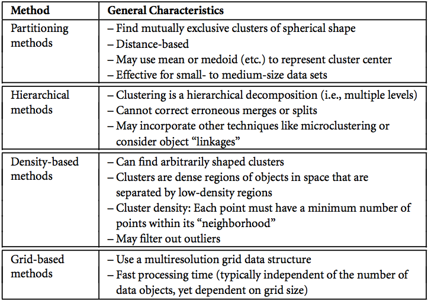

目前聚类分析主要集中于距离的分析，最常用的几种包括k-均值（k-means）,k-中心点（k-medoids）等。在机器学习领域，分类称为监督学习，因为给定了类标号信息，即学习算法是监督的，因为它被告知每个训练元组的类隶属关系。聚类被称为无监督学习，因为没有提供类标号信息。

### 对聚类分析要求

1. 可伸缩性：

	能够对大量海量数据依旧具有较准确的结果。

2. 处理不同属性类型的能力：

	要能够处理非数值型数据，如二元的、对称的、序数的等。

3. 发现任意形状的簇：

	基于距离度量算法趋向于发现具有相近尺寸和密度的球状簇，要能处理任意形状的簇。

4. 对于确定输入参数的领域知识的要求：

	聚类算法需要提供的参数需要由用户提供，需要用户具有一定的专业基础，如果提供的参数值不当将严重影响结果。

5. 处理噪声数据的能力：

	现实情况下，数据中会包含离群值、缺损值或者错误数据，优秀的聚类算法要能够对这些无效数据不敏感。

6. 增量聚类对输入次序不敏感：

	- 增量聚类：许多情况下会有新数据产生，算法能够即使更新结果而不用从头重新开始聚类。
	
	- 次序不敏感：聚类算法对提供次序不同的数据都能得到近似结果。

7. 聚类高维数据能力：

	某些数据集可能包含大量的维和属性，如文档聚类时每个关键字都可以看成看做一个维，聚类算法要能够满足高维数据的处理，而不仅仅集中在二、三维数据。

### 基于划分的方法

给定一个n个对象的集合，构建数据的k个分区(k<=n)，每个分区表示一个簇.簇内的元素相似，簇间元素相异。

#### k-均值（基于形心的技术）

k-均值算法流程如下：

1. 随机选择k个对象，每个对象代表一个簇的初始均值或中心。

2. 对剩余的每个对象，根据它与簇均值的距离，将他指派到最相似的簇。

3. 计算每个簇的新均值。

4. 回到步骤2，循环，直到准则函数收敛。   

优点：

1. 算法复杂度较低，为O(nkt)，其中n为对象总数，k是簇的个数，t是迭代次数。

2. 对大数据集，该算法是相对可伸缩的和有效的。

缺点：

1. 只有当簇均值有定义的情况下，k均值方法才能使用。

2. 不适合发现非凸形状的簇，或者大小差别很大的簇。

3. 用户必须首先给定簇数目。

4. 对噪声和离群点数据敏感。
 
   - 一个具有很大极端值的对象可能显著的扭曲数据的分布。
    
   - 平方误差函数将进一步严重恶化这种影。

#### k-中心点（基于代表对象的技术）

k-均值算法可能对离群点敏感性过高，所以可以不采用簇中对象的均值作为参照点，而是挑选实际对象来代表簇。每个簇使用一个代表对象，其余每个对象被分配到与其最为相似的代表性对象所在的簇中。划分方法基于最小化所有对象p与其对应的代表对象之间的相异度之和的原则来划分。假设有k个簇，计算各个簇中的代表对象为oi与所有对象p求绝对误差dist(p, oi)，并将所有簇的该值累加。k-中心点聚类通过最小化该绝对误差，把n个对象划分到k个簇中。

当k=1时，可以在O(n2)时间内找到准确的中位数，但k为一般正整数时，k-中心点问题是NP-Hard问题。

### 基于密度的方法

划分和层次的方法旨在得到球状簇，其他形状的簇不能准确识别。为了发现任意形状的簇，可以把簇看做数据空间中被稀疏区域分开的稠密区域，这是基于密度的聚类方法的主要策略。该方法可以用于发现非球状簇。

#### DBSCAN

在区域中，对象o的密度可以通过靠近o的对象数度量。DBSCAN找出核心对象，即邻域稠密的对象，它连接核心对象和它们的邻域，形成稠密区域作为簇。

##### 基本概念

- 当我们确定某个核心点之后需要两个参数来帮助我们判断，一是给定r来指定对象邻域的半径，另一个是密度阀值MinPts（邻域的密度可以简单地用邻域内的对象数来度量）。当该区域内密度可达对象数超过MinPts阀值时，则该区域就是稠密区域。我们假定p是核心对象，则在以p为中心r为半径的区域内，所有其它对象q都是直接密度可达的。

- 考虑如果存在对象链p1, p2, p3……pn，其中每个pi属于D且均有pi+1是从pi直接密度可达，则pn是从p1密度可达的。若二者都是核心对象，当pn是从p1密度可达，也有pn是从p1密度可达。但若二者不全是核心对象，则不具有对称性。
	
- 若要将核心区域和其近邻连接成一个稠密区域，DBSCAN中用到了密度相连的概念。如果存在一个对象q，使得对象p1和p2都是从q密度可达的，则p1和p2是密度相连的，相比于密度可达，密度相连是等价关系。
	
###### 密度可达及密度相连例题

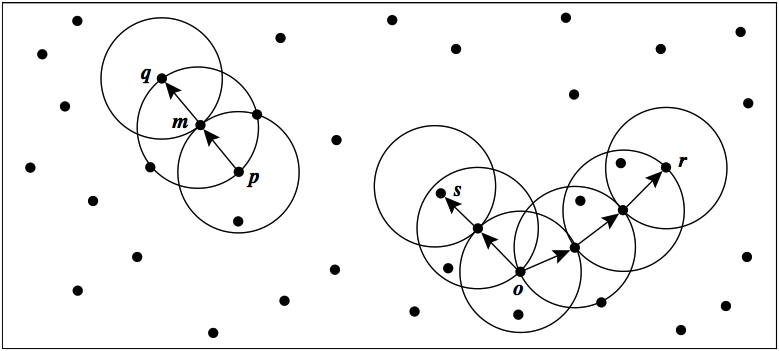

假设m, p, o, r都是核心对象，MinPts = 3。

从图中可以看出，所有原形区域内的对象数都至少大于等于MinPts，所以q是从m直接密度可达，m是从p直接密度可达。

考虑左侧这个图形，可见m是从p密度可达的，q是从m密度可达的，所以q是从p密度可达的。但因为q不是核心对象，所以p并不是从q的密度可达。

在右侧的图中，s是从的o的密度可达，r也是从o的密度可达，所以o, r, s是密度相连的。

##### 簇的发现

首先所有对象都被标记为unvisited，随机选取一个未访问对象p并检查其半径r区域内是是否至少有MinPts个对象，若无MinPts个对象则标记为噪点。当含有MinPts个对象后，为其创建簇C（初始为空），另外将其邻域内所有对象添加进集合N中。接着从N中迭代选取不属于其他簇的元素p'，添加到簇C中，将其标记为visited。如果p'的邻域内至少有MinPts个元素，则将其邻域内对象添加到集合N中。重复以上过程直到簇C不能继续扩展。此时，簇C生成并被输出。

为了找出下一个簇，随机从未访问的节点中选出一个重复上面的步骤，直到所有对象都被访问。

可见，簇的发现过程其实和广度优先遍历还是很像的，只不过拓展集合N时将相连节点换成了这里直接密度可达元素，访问节点的过程替换成了添加到簇C的过程。而每次重新随机选择新节点的过程也和广度优先遍历中选择新的连通分量很接近。

