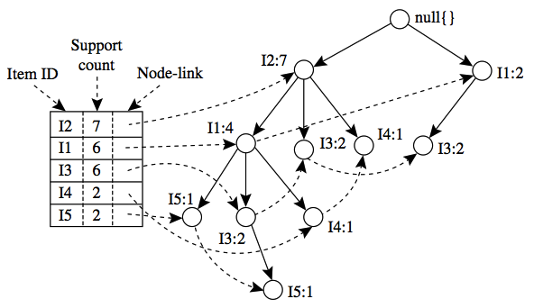

# 数据挖掘
## 数据预处理

## 数据仓库和联机分析处理
### 数据仓库
#### 联机分析处理（OLAP）

##### OLAP基本操作

1. 上卷（roll-up）

	通过沿一个维的概念分层向上攀升或者通过维规约在数据立方体上进行聚集。如location层被定义为全序street<city<province<country，对city做上卷操作，将会由city层向上到country层聚集数据，结果立方体按country而不是对city对数据分组。
	
2. 下钻（drill-down）

	下钻由不太详细的数据到更详细的数据。下钻可以沿维的概念分层向下或引入附加的维来实现，结果数据立方体会列出更为具体的数据分组。
	
3. 切片（slice）

	在给定的数据立方体的一个维上进行选择，导出一个子立方体。被选择的维上只有特定一种属性。

4. 切块（dice） 

	在两个或者多个维上进行选择，定义子立方体。

5. 转轴（pivot）

	转轴是一种目视操作，提供数据的替代表示。

## 挖掘频繁模式、关联和相关性

频繁模式是频繁地出现在数据集中的模式，频繁地出现在交易数据集中的商品的集合是频繁项集。如果一个子结构频繁地出现，则称它为结构模式。对于数据挖掘之间的关联。相关性和许多其他有趣的联系，发现这种频繁模式起着至关重要的作用。

下面简单介绍一下常见术语。项的集合称为项集，包含k个项的项集称为k项集。项集的出现频度是包含项集的事务数，简称为项集的频度、支持度计数或计数。如果项集I满足预定义的最小支持度阀值（即I的绝对支持度满足对应的最小支持度计数阀值），则I为频繁项集。频繁k项集的集合通常计为Lk。

### 关联规则

一般而言，关联规则的挖掘是一个两步的过程：

1. 找出所有的频繁项集：

	这些项集的每一个频繁出现次数至少与预定义的最小支持计数min_sup一样。

2. 由频繁项集产生强关联规则：

	这些规则必须满足最小支持度和最小置信度。
	
由于第二步开销远低于第一步，所以挖掘关联规则的总体性能由第一步决定。另外，在后面的例子中也将看到，大型数据库中主要挑战是，这种方式常会产生大量满足最小支持度阀值的项集，当min_sup（最小支持度阀值）较低时尤其如此，所以项集的数量会非常巨大，因此引入了闭频繁项集和极大频繁项集两个概念，不过这里不会展开去说。上面已经说到，在找到关联规则，首先需要找出所有的频繁项集，最简单的挖掘频繁项集的方法便是Apriori算法。

#### Apriori算法

Apriori是一种发现频繁项集的基本算法，它使用一种称为逐层搜索的迭代方法，其中k项集用于搜索(k + 1)项集。扫描数据库，累计每个项的计数，并收集最小支持度的项，找出频繁1项集的集合，计为L1。然后，使用L1找出频繁2项集的集合L2……如此下去，直到不能找到频繁k项集，找出每个Lk需要一次数据库的完整扫描。

为了提高频繁项逐层差产生的效率，需要用到先验性质来减少搜索次数：频繁项的所有非空子集也一定是频繁项。

先验性质的使用需要通过下面两个步骤来实现：

1. 连接步：

	为了找出Lk，通过将Lk-1与自身连接产生候选k项集的集合，计为Ck。
	
2. 剪枝步：

	Ck是Lk的超集，也就是说在Ck中的项集是频繁k项集Lk的超集。可以通过比较Ck中的计数和最小支持度计数大小来去除所有不属于Lk中的集合。但是由于Ck可能很大，所以时间复杂度依旧非常可观，这就需要我们事先对Ck进行减枝。根据先验性质，如果Ck的任何(k - 1)项子集不在Lk-1中，则该候选也不会是频繁的，从而从Ck中删去，以减少计算量。
	
下面以一个例子来说明Apriori算法。

 

具体过程将配合下图进行讲解，假设该例中最小支持度计数为2。

1. 第一次迭代时，所有候选项都是候选1项集的集合C1的成员，算法简单统计每个项的出现次数。

2. 将C1表计数列数值逐个与最小支持度计数比较，因均>=2，所以L1和C1相同。

3. L1作自身连接得到C2。

4. 因L1包含所有元素，所以先验性质并未在此步剪枝。

5. 统计每项次数。

6. 将C2中各个元素次数与最小支持度计数比较，删除小于最小支持度计数的元素，得到L2。

7. L2作自身连接得到C3。

8. C3 = {{I1, I2, I3}, {I1, I2, I5}, {I1, I3, I5}, {I2, I3, I4}, {I2, I3, I5}, {I2, I4, I5}}，因为若要成为频繁项集的子项都必须全是频繁子项，所以上述所有集合的子集合若不能全部出现在L2中则要删除。（例：L2中不包含{I3, I5}，所以C3中{I1, I3, I5}元素删去）。剪枝后仅有两个集合元素。

9. 统计每项的次数。

10. 与最小支持度计数比较，删除不符合的元素。

11. 重复上面的操作，得到C4 = {I1, I2, I3, I5}，因为其子集{I2, I3, I5}不是频繁的，所以C4为空，算法终止，找出了所有频繁项集。

不过Apriori算法虽然实现简单，但是可能需要产生大量候选项集并且可能需要重复地扫描数据库。

#### FP-growth算法

频繁模式增长使用分治策略，首先将代表频繁项集的数据库压缩到一颗频繁模式树中，该树仍保留项集的关联信息。然后，把这种压缩后的数据库划分成一组条件数据库，每个数据库关联一个频繁项和模式段，并分别挖掘每个条件数据库。对于每个模式片段，只需要考察与它相关联的数据集。因此，随着被考察模式的增长，这种方法可以显著地压缩被搜索的数据集大小。

数据库第一次扫描与Apriori相同，它能导出频繁项（1项）的集合，将得到的频繁项的集合按支持度计数的递减序排序，结果记作L。用上一个例子，则L = {{I2:7}, {I1:6}, {I3:6}, {I4:2}. {I5:2}}。

之后需要两步来完成。

1. 构造FP树

构造FP树时，首先创建树的根节点，用NULL标记。之后扫描数据库，每个事务中的项按L中的次序处理。扫描第一个事务T100：I1, I2, I5。导致构造树包含三个节点的第一个分枝，<I1, 1>，<I2, 1>和<I5, 1>，其中I2作为根的子女链接到根，I1链接到I2，I5链接到I1。之后扫描第二个事务T200：I2, I4，它导致一个分枝，I2链接到根，I4链接到I2，因为I2已经存在于FP树中，所以这里I4共享I2前缀，之后被共享的I2的计数加1，并创建新节点<I4，1>链接到I2上。通常，当为每个事务增加分枝时，沿共同前缀上的每个节点计数加1。

为了方便树的遍历，创建一个项头表，使每项通过一个节点链指向它在树中的位置。

2. FP树挖掘

FP树挖掘的过程由长度为1的频繁模式开始，构造它的条件模式基（由FP树中与该后缀模式一起出现的前缀路径组成）。然后构造它的条件FP树，并递归地在该树上进行挖掘。模式增长通过后缀模式与条件FP树产生的频繁模式连接实现。

如本例，从L表中最后的I5开始，首先找出FP树中所有以I5为后缀的路径<I2, I1, I5:1>和<I2, I1, I3, I5:1>，它的前缀路径为<I2, I1:1>和<I2, I1, I3:1>，它们构成I5的条件模式基。使用这些条件模式基构造I5的条件FP树，它只包含单个路径<I2:2, I1:2>，不包含I3（因为I3的支持度计数小于最小支持计数）。该单个路径产生频繁模式的组合<I2, I5:2>，<I1, I5:2>，<I2, I1, I5:2>。

同理，以I4为后缀的路径有<I2, I1, I4:1>和<I2, I4:1>。形成的条件模式基本为<I2:I1:1>和<I2:1>，产生一个条件FP树<I2:2>，导出一个频繁模式<I2, I4:2>。

同理可以得到I3和I1的频繁模式。

## 分类和预测

分类是一种重要数据分析形式，它提取刻画重要数据类的模型，这种模型称为分类器，用来预测分类的类标号。举个简单例子来说，银行在对个人信息进行分析后，可以进行初步判断该客户贷款申请是安全的还是危险的。另一种方式是对连续值函数或有序值进行预测，这种模型是预测器。比如更具消费者日常消费习惯预测消费者在特定日期消费金额数。所以分类的实质其实是通过已有训练数据生成一种能够匹配这些数据的模型，进而用此模型将其他只含有数据库元组的数据对应到某一具体类标号中。

### 分类步骤

通常分类有两个基本步骤。

1. 建立分类模型（学习阶段）：
	
	从机器学习的角度看，分类是一种有指导的学习，即每个训练数据由数据库元组和关联的类标号组成，通过学习形成数据元组和类标识之间对应的知识。元组用n维向量表示，分别表示元组在n个数据库属性A1，A2，A3……An上的n个度量，每个元组都有一个预先定义好的类标号c，则训练数据样本为X = (x1, x2, x3……xn, c)。因为每个训练数据都提供了训练元组和类标号，这一阶段又叫做监督学习。
	
	分类过程在学习阶段可以看成是学习一个映射关系y=f(X)。通过训练集得到这一映射关系之后再将给定元组作为输入就可以得到X的类标号y。典型情况下该映射用分类规则、决策树或数学公式提供。

2. 使用模型为数据的类标号：

	在这一阶段我们首先需要做得是对模型的准确性进行评估。对数据进行评估需要采用检验集，检验集和训练集有着相同的结构，都是包含数据元组及类标识。将检验集的数据元组作为前一步骤生成的模型的输入部分，然后讲输出部分和检验集原本的类标识进行比较，以此来确定准确率。如果测试集得到的准确率较高，则可以用此模型来对数据进行分类。
	
除了以上两点，有监督学习还必须注意的地方就是过分拟合问题。考虑一种可能情况就是训练数据中含有少量严重失准的数据，如果模型对这部分数据也进行拟合，最终的结果可能会比较糟糕。
	
### 常见分类方法

这里主要说明下决策树归纳和朴素贝叶斯分类方法。

#### 决策树归纳

决策树归纳是从训练元组中学习决策树。决策树内部节点（非树叶节点）表示在一个属性上的测试，每个分枝表示该测试的一个输出，每个输液节点存放一个类标号。

使用决策树时，给定一个类标号未知的元组X，在决策树上测试该元组的属性值。跟踪一条由根到叶节点的路径，该叶节点就存放着该元组类的预测。

决策树被用于分类有以下几点优势。

1. 不需要任何领域知识或参数设置。

2. 决策树可以处理高维数据。

3. 树形结构容易被人理解。

##### 决策树构造方法

##### 属性选择度量
属性选择度量是选择分裂准则，把给定类标记的训练元组的数据分区D最好地划分成单独类的启发式方法，这里最好的表示分类准则导致的划分，划分后各个分区应当是纯的（落在一个给定分区的所有元组都属于相同的类）。每次具有最好度量得分的属性被选为给定原则的分裂属性，从准则的每个输出生长出分枝，并且相应地划分元组。下面是三种常用的属性选择度量。

1. 信息增益：

	ID3使用信息增益作为属性选择度量。

2. 增益率：

	C4.5使用增益率作为属性选择度量。

3. 基尼指数：

	基尼指数在CART中作为属性选择度量。

##### 树减枝

#### 贝叶斯分类

在贝叶斯分类中，设X是数据元组，或者看做证据，通常用n个属性集的测量值表示。令H为某种假设，如数据元组在某个特定的类C。对分类问题，期望由给定的证据X得到假设H成立的概率P(H|X)。

贝叶斯定理中需要先明确两个概念：

1. 后验概率：P(H|X)，是指在X成立的条件下H的后验概率。

2. 先验概率：P(H)，是指在H成立的概率，而不在附加任何其他条件的情况下。

类似地，P(X|H)表示在某种状态发生的情况下，其满足条件X的概率。

因为P(X)，P(H)和P(X|H)可以由给定的数据估计，所以可以根据贝叶斯定理计算后验概率P(H|X)的方法。

- P(H|X) = (P(X|H)*P(H)) / P(X)

##### 朴素贝叶斯分类

1. D是训啦你元组和关联的类标号集合D=(X, C)。

2. 假定有m个类(待预测情形)，分别为C1，C2……Cm，分类将预测具有最高后验概率的类(在X条件下)，也就是说预测X属于类Ci当且仅当P(Ci|X) > P(Cj|X)，这样P(Ci|X)最大的类Ci称为最大后验假设。又因为对各个结果而言，P(X)是常量，所以仅需比较P(X|C)•P(C)的值即可。

3. 朴素假定。当给定具有许多属性的数据集，计算P(X|Ci)的开销可能非常大，为了降低计算难度，可以做类条件独立的朴素假设。给定元组的类类标号，假定属性具有条件地相互独立，因此P(X|Ci)=P(x1|Ci)•P(x2|Ci)•P(x3|Ci)……P(xk|Ci)。（这也是为什么叫做朴素贝叶斯的原因：假定各属性有条件地相互独立）

4. 预测X的类标号，选取Ci的最大后验假设。

举个例子来使用贝叶斯分类预测类标号。

- 待分类元组X=(age=youth, income=medium, student=yes, credit_rating=fair)

- 类标号C=( C1=(buys_computer=yes), C2=(buys_computer=no) )

计算P(Ci):

- P(buys_computer=yes)=9 / 14 = 0.643

- P(buys_computer=no)= 5 / 14 = 0.357

计算P(X|Ci)各分量:

- P(age = youth | buys_computer = yes) = 2 / 9 = 0.222

- P(age = youth | buys_compuyer = no) = 3 / 5 = 0.6

- P(income = medium | buys_computer = yes) = 4 / 9 = 0.444 

- P(income = medium | buys_computer = no) = 2 / 5 = 0.4

- P(student = yes | buys_computer = yes) = 6/ 9 = 0.667

- P(student = no | buys_computer = no) = 1 / 5 = 0.2

- P(cridit_rating = excellent | buys_computer = yes) = 6 / 9 = 0.667

- P(cridit_rating = fair | buys_computer = no) = 2 / 5 = 0.4

计算P(X|Ci):

- P(X | buys_computer = yes) = 0.222 • 0.444 • 0.667 • 0.667 = 0.044 

- P(X | buys_computer = no) = 0.6 • 0.4 • 0.2 • 0.4 = 0.019

找出最大化P(X|C) • P(C)

- P(X | buys_computer = yes) • P(buys_computer = yes) = 0.044 • 0.643 = 0.028

- P(X | buys_computer = no) • P(buys_computer = no) = 0.019 • 0.357 = 0.007

因此，对于上述元组X，朴素贝叶斯预测X类为buys_computer = yes。	
当然，若上述第二步中某个分量为0的话，最终计算时结果会直接为0，萎了解决这个问题可以将所有计数加1以解决这个问题，这种方法称为拉普拉斯校准。

## 聚类分析

聚类是一个把对象集划分成多个组或簇的过程，使得簇内对象具有很高的相似性，但与其他簇中的对象很不相似。相似性和相异性的评估通常需要涉及距离，但基于距离的聚类算法往往发现的是球形的聚类，不能用于任何形状的簇。比如在图像识别应用中（识别数字），不同人写的数字具有不同的习惯，我们可以使用聚类确定某个数字的子类，每个子类代表可能出现的某个数字的变体，使用基于子类的多个模型可以提高整体识别的准确率。

目前聚类分析主要集中于距离的分析，最常用的几种包括k-均值（k-means）,k-中心点（k-medoids）等。在机器学习领域，分类称为监督学习，因为给定了类标号信息，即学习算法是监督的，因为它被告知每个训练元组的类隶属关系。聚类被称为无监督学习，因为没有提供类标号信息。

### 对聚类分析要求

1. 可伸缩性：

	能够对大量海量数据依旧具有较准确的结果。

2. 处理不同属性类型的能力：

	要能够处理非数值型数据，如二元的、对称的、序数的等。

3. 发现任意形状的簇：

	基于距离度量算法趋向于发现具有相近尺寸和密度的球状簇，要能处理任意形状的簇。

4. 对于确定输入参数的领域知识的要求：

	聚类算法需要提供的参数需要由用户提供，需要用户具有一定的专业基础，如果提供的参数值不当将严重影响结果。

5. 处理噪声数据的能力：

	现实情况下，数据中会包含离群值、缺损值或者错误数据，优秀的聚类算法要能够对这些无效数据不敏感。

6. 增量聚类对输入次序不敏感：

	- 增量聚类：许多情况下会有新数据产生，算法能够即使更新结果而不用从头重新开始聚类。
	
	- 次序不敏感：聚类算法对提供次序不同的数据都能得到近似结果。

7. 聚类高维数据能力：

	某些数据集可能包含大量的维和属性，如文档聚类时每个关键字都可以看成看做一个维，聚类算法要能够满足高维数据的处理，而不仅仅集中在二、三维数据。

### 基于划分的方法
给定一个n个对象的集合，构建数据的k个分区(k<=n)，每个分区表示一个簇.簇内的元素相似，簇间元素相异。

#### k-均值（基于形心的技术）

k-均值算法流程如下：

1. 随机选择k个对象，每个对象代表一个簇的初始均值或中心。

2. 对剩余的每个对象，根据它与簇均值的距离，将他指派到最相似的簇。

3. 计算每个簇的新均值。

4. 回到步骤2，循环，直到准则函数收敛。   

优点：

1. 算法复杂度较低，为O(nkt)，其中n为对象总数，k是簇的个数，t是迭代次数。

2. 对大数据集，该算法是相对可伸缩的和有效的。

缺点：

1. 只有当簇均值有定义的情况下，k均值方法才能使用。

2. 不适合发现非凸形状的簇，或者大小差别很大的簇。

3. 用户必须首先给定簇数目。

4. 对噪声和离群点数据敏感。
 
   - 一个具有很大极端值的对象可能显著的扭曲数据的分布。
    
   - 平方误差函数将进一步严重恶化这种影。

#### k-中心点（基于代表对象的技术）

k-均值算法可能对离群点敏感性过高，所以可以不采用簇中对象的均值作为参照点，而是挑选实际对象来代表簇。每个簇使用一个代表对象，其余每个对象被分配到与其最为相似的代表性对象所在的簇中。划分方法基于最小化所有对象p与其对应的代表对象之间的相异度之和的原则来划分。假设有k个簇，计算各个簇中的代表对象为oi与所有对象p求绝对误差dist(p, oi)，并将所有簇的该值累加。k-中心点聚类通过最小化该绝对误差，把n个对象划分到k个簇中。

当k=1时，可以在O(n2)时间内找到准确的中位数，但k为一般正整数时，k-中心点问题是NP-Hard问题。

### 基于密度的方法

#### DBSCAN

