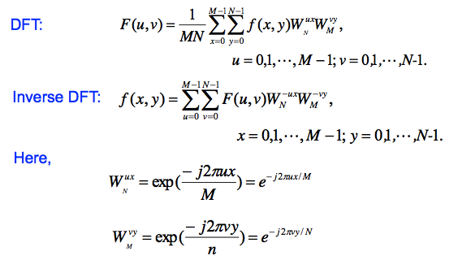

# 数字图像处理

---

## 数字图像基础

### 采样与量化

一幅图像的x和y坐标及幅度都可能是连续的，为了把它转化为数字形式，必须在坐标和幅度上都进行取样操作。数字化坐标值是采样，数字化幅度值是量化。

当我们取某幅图片某行数据时，会得到连续的灰度值曲线，其中随机变化由噪声引起。再对该行数据进行分段，每个小段就是取样位置，对曲线的值进行离散化到特定分级中，每个灰度级赋予一个特定值，如量化到256个灰度级。

从图像定点开始逐行进行执行这一过程就能产生一幅二维数字图像。

#### 数字图像表示

假设完成数字图像采样和量化工作，则会得到一个M×N的矩阵，矩阵每个点对应一个灰度值。除此之外，还可以用二维离散亮度函数f(x, y)表示，其中x和y表示坐标，f(x, y)的值代表了点(x, y)处像素的灰度值。

#### 数字图像存储

灰度典型的取值是２的整数次幂，即L=2k。离散灰度值是等间隔的并且是区间[0, L - 1]内的整数，灰度取值范围又称为动态范围。假设数字b是存储数字图像的比特数，则b=M×N×k。

#### 上采样

上采样简而言之就是图像放大，执行放大需要两个步骤，创立新的像素位置和对这些新位置像素赋灰度值。当图像整数倍放大时，最简单的就是像素的方法，复制最近的一行灰度值。

#### 下采样

用于图像缩小，最常见的是隔行保留。可以通过左乘或者右乘矩阵得到。

### 相邻像素

1. 4邻域

	用N4(p)表示像素p的４邻域，它们的坐标为(x+1, y), (x-1, y), (x, y+1), (x, y-1)。
	
	像素点p,q，若q在N4(p)中，则这两个像素４连通。
	
2. D邻域

	用Nd(p)来表示，它们的坐标为(x-1, y+1), (x-1, y-1), (x+1, y+1), (x+1, y-1)。
	
3. 8邻域

	用N8(p)表示，N8(p)=N4(p)+Nd(p)。
	
### 像素连通性

像素连通必要条件：

1. 两个像素位置是否相邻

2. 两个像素点的灰度值满足某种相似准则（值域V）

	用Ｖ定义邻接性像素的灰度集合，Ｖ可能是0-255中任何一个子集。

1. 4邻接

	若q在N4(p)中，则具有Ｖ中数值的p和q是４邻接的。
2. 8邻接

	若q在N8(p)中，则具有Ｖ中数值的p和q是8邻接的。
	
3. m邻接

	若q在N4(p)中，或者q在ND(p)中且N4(q)与N4(p)没有Ｖ值的像素，则具有V值的像素p和q是m邻接的。
	
	在m邻接中包含了所有的4邻接情况，除此之外判断D邻域中属于V的点，若彼此４邻域交集不含V点，则p和q是m邻接的。
	
### 通路

讨论邻接问题主要是为了寻找图像中通路（边缘），若有(x0, y0)......(xn, yn)邻接，则起点p和终点q形成通路，具体是什么通路和邻接方式有关。n为路径长度。
	
### 距离度量
1. 欧式距离

	直角三角形斜边距离。
	
2. 街区距离
	
	横纵两方向距离差值绝对值。
	
	D4(p, q) = |x-s| + |y-t|
	
3. 棋盘距离

	D8(p, q) = max(|x-s|, |y-t|)
	
---

## 空间域图像增强

### 直方图处理

灰度级为[0, L-1]范围的数字图像的直方图是离散函数和h(rk)=nk，其中rk是第k级灰度，nk是第k级灰度的像素个数。用nk去除像素的总个数可以得到归一化的方程，P(rk)=nk/n=nk/(M•N)，表示每个灰度级别的像素占总像素的比例。

通常一幅灰度均匀分布的图像的效果会比分布不均的图像好很多，所以我们尝试寻找一种方法能够自动对图像进行处理，使得图像的灰度能够分布更加均匀。

### 直方图均衡化

直方图均衡化具有自动化处理的优点且效果大部分情况下都很好，运用很广。主要步概念如下。

假设r被归一到区间[0, 1]中，r=0表示黑色，r=1表示白色，考虑一个离散公式对于任何一个给定的r都有:
	
- s=T（r）

即给定一个灰度值r都会得到一个相应的灰度值s，不过要求这个变换函数具有如下性质：

- T(r)为单值函数，保证反变换存在

- T(r)为单调函数，从而能保证从黑道白的顺序

在诸多函数中，满足上面两个条件且计算容易的函数就是概率分布分布函数了。

- sk = Sum(Pr(rj))

即sk计算了从灰度值为0都灰度值为k的所有灰度的出现概率之和，显然具有单值和单调性。

所以，最终的直方图均衡化公式为：

- sk = (L-1) Sum(nk/(M•N))

之后可以将每个像素的灰度值重新映射到新的灰度sk中。

所以，总结直方图均衡化的步骤就是:

1. 统计各灰度值出现的次数。

2. 计算各灰度值占总像素数比例。

3. 计算概率分布函数T®。

4. 计算新的映射灰度值s<k/sub>。

### 用算数/逻辑操作增强

算数/逻辑操作主要以像素为基础在两幅或者多幅图像间进行，最常见的有图像减法处理和图像平均处理。

#### 图像减法处理

两幅图像的差异表示为：

- g(x, y) = f(x, y) - h(x, y)

图像差异是两幅图像对应像素点的差值形成的。当两幅图差异很小时，相见的结果趋向于0。

#### 图像平均处理

假设将噪声h(x, y)加入到原始图像f(x, y)中，则形成的带噪图像g(x, y)。

- g(x, y) = f(x, y) + h(x, y)

图像平均处理的思想就是使用多张图片求平均，各个图片同一像素点求和后的值除以参与计算的图片数。这种方式叠加方式可以去除某些随机噪声，使用照片越多，噪声叠加求和后的值越趋于0。

### 空间滤波基础 

空间滤波处理主要有两类，一种是通过映射函数，将某一点的灰度值直接映射到另一个，另一种是操作是对某像素点及其周边邻域范围内多个像素点灰度值进行计算，这个邻域范围内形成的子图像又可以称为滤波器、掩模或者核。在滤波器中子图像的值是系数值，而不是像素值。

通常用m•n的滤波器进行线性滤波的形式和卷积处理的概念很相似，因此线性空间滤波处理 经常被称为掩模与图像的卷积。所以卷积模板、卷积核一词也常用于此。

实践中常用如下形式表示：

- R = h(i, j) = w1•p1 + w2•p2 + w3•p3 + …… + wn•pn

### 平滑空间滤波

#### 平滑线性滤波器

平滑线性滤波器最大的作用就是去噪，基本的操作就是将掩膜范围内像素点做均值处理并填入f(x, y)中。当然，有些时候，中心点权重会大于周围邻域内的数值，具体调整根据需求来定，不过有一定是确定的，就是掩膜各个元素的和加起来为1。一般如果掩膜大小过大，则会导致图像大面积模糊化，反而不利。

#### 统计排序滤波器

统计滤波器是非线性空间滤波器，它的影响基于图像滤波器包围的像素区域中像素的排序，然后用统计结果决定代替中心像素的值。

最常见的统计滤波器就是中值滤波器，中值滤波器选取滤波区域内数值中点赋予给像素点。中值滤波器可以比较好地处理噪声，尤其是椒盐噪声。不过中值滤波器对于图像的模糊化程度不及平滑线性滤波器，这点也算是优点。

### 锐化空间滤波

……

---

## 频域图像增强

### 傅里叶变化和频域介绍

#### 二维DFT及其反变换

#### 频域中滤波的步骤

1. 用(-1)x+y乘以输入图像进行中心变换。

2. 用上一步的结果计算图像的DFT，即F(u, v)。

3. 用滤波器函数H(u, v)乘以F(u, v)。

4. 计算上一步结果中的反DFT。

5. 得到上步中结果的实部。

6. 用(-1)x+y乘以上部中的结果。

H(u, v)称为滤波器的原因是它在变换中抑制某些频率，但其他频率不受影响。

f(x, y)表示输入图像，F(u, v)表示它的傅里叶变换。目标是通过选出的滤波变换函数H(u, v)，通过衰减F(u, v)的高频成分产生G(u, v)。

总之，上述步骤可以概括为：

- 输入图像(f(x, y)) -> 前处理(f(x,y)乘以(-1)x+y) -> 傅里叶变换(得到F(u, v)) -> 乘以滤波函数(F(u, v)•H(u, v)) -> 傅里叶反变换 -> 后处理 -> 增强图像(g(x, y))

所以，主要难点集中于DFT及反DFT过程以及滤波函数H(u ,v)的选择。

### 平滑频域滤波器

图像边缘和其它尖锐变化（如噪声）在图像的灰度级中主要处于傅里叶变换的高频部分。因此，平滑（模糊）可以通过衰减指定图像傅里叶变换中高频成分的范围来实现。即让低频通过，衰减高频部分，所以这部分滤波器均是低通滤波器。

主要包括理想低通滤波器、巴特沃思低通滤波器、高斯低通滤波器。

### 频域锐化滤波器

由于在灰度级的边缘和其他地方急剧变化和高频有关，所以图像的锐化能够在频域用高通滤波处理实现。

主要包括理想高通滤波器、巴特沃思高通滤波器、高斯高通滤波器。从左到右三种滤波器涵盖了从非常尖锐到非常平坦范围的滤波。

---

## 图像复原

图像复原与图像增强区别：图像增强侧重主观探索，图像复原是客观过程，需要利用先验知识从退化和干扰图像中去除模糊因素和噪声，尽可能还原图像原貌，通常是先把退化和干扰模型化，然后采用相反过程处理复原图像。

### 图像退化/复原过程模型

图像退化过程可以被模型化为一个退化函数和一个加性噪声项，对一副输入图像f(x, y)，产生一副退化图像g(x, y)。给定f(x, y)的退化函数h(x, y)和加性噪声t(x, y)，可以得到退化图像由下式给出：

- g(x, y) = f(x, y)•h(x, y) + t(x, y)

当我们得到的h(x, y)和t(x, y)信息越多，最终复原出的图像越接近于f(x, y)。

### 噪声模型

#### 高斯噪声 

电子电路噪声、低照明度或高温引起的传感噪声。

#### 脉冲噪声（椒盐噪声）

成像中短暂停顿引起的噪声。

### 只存在噪声的空间滤波复原

当仅有加性噪声存在时，可以选择空间滤波的方法。

#### 均值滤波器

##### 算数均值滤波器

令Sxy表示中心在(x, y)，尺寸为m•n的矩形子图像窗口的坐标组，复原的f'(x, y)的值就是在Sxy区域内被干扰图像g(x, y)的算数均值。

模糊图像同时减少噪声。

##### 几何均值滤波器

Sxy概念同上，这里先将m•n区域内g(x, y)的值累乘，然后开(1 / m•n)次方根。

平滑程度较好，但会损失图像细节。

##### 谐波（调和）均值滤波器

先计算所有(1 / g(x, y))的值的累加和，之后用mn去除以这个值得到f'(x, y)。

对盐噪声效果较好，但不适合椒噪声，善于处理高斯噪声那样的噪声。

##### 逆谐波（反调和）均值滤波器

适合在实际中消除椒盐噪声。

- Q = 0，算数中值滤波器。

- Q = - 1，调和均值滤波器。

- Q > 0，适合消除胡椒噪声。

- Q < 0，适合消除盐噪声。

选择错符号会加剧椒盐噪声的程度。

#### 统计排序滤波器

##### 中值滤波器

用与该像素相邻像素的灰度中值来代替该像素的值。

对多种噪声效果较好，且在相同尺寸下相比线性平滑滤波器引起的模糊更少。对单极或双极噪声非常有效。

##### 最大值和最小值滤波器

选取相邻像素中最大或最小灰度值来替代该像素的值。

- 胡椒噪声值很低，所以用最大值滤波器可以有效消除胡椒噪声。

- 盐噪声值比较高，所以用最小值滤波器可以有效消除盐噪声。

##### 中点滤波器

计算滤波器范围内最大灰度值和最小灰度值的均值，并用来代替f(x, y)点的值。

结合了统计排序和求平均，对高斯和均匀随机噪声效果最好。

##### 修正后的阿尔法均值滤波器

在Sxy领域内去除g(x, y)最高灰度值的d/2和最低灰度值的d/2，剩下的部分求均值。其中d的值可以自定义，如d = 6时，计算均值时，去掉灰度值最高的和最低的各三个灰度值的的像素点。

- d = 0退化为算数均值滤波器。

- d = mn - 1，退化为中值滤波器。

d去不同值可以应对不同情况，尤其是高斯噪声和椒盐噪声混合的情况。

---

## 彩色图像处理

### 彩色基础                                                                                                                                                                                                                                                                               
                                                                                                                                                      
#### RGB彩色模型

每种颜色出现在红、绿、蓝的原色光谱分量中，这个模型基于笛卡儿坐标系统。在RGB模型中，所表示的图像由3个分量组成，每个分量图像都是其原色图像。其中每一幅都是一幅8比特图像，在这种条件下，每个RGB彩色像素称为24比特深度。在24比特的RGB图像中，颜色总数是224。

还有一种称为稳定彩色的RGB模型，假设256种颜色是最小颜色数，其中216种是稳定彩色，另外40色留给操作系自行处理。这样RGB三个通道的取值只能取0，51，102，153，204，255，也就是63。

#### CMY和CMYK模型

青，深红，黄色是光的二次色，即颜料的颜色。当青色颜料涂覆的表面用白光照射时，该表面反射的不是红光，而是从反射的白光中减去红色，白光本身是红绿蓝光的组合。

在纸上沉积颜料的设备，要求输入CMY数据或在内部进行RGB到CMY的转换：CMY = 1 - RGB。这里的彩色值都被归一化到了[0, 1]的范围内。

一种形象的理解是，光的三原色是在黑的背景下往上加颜色，通过aR + bG + cB可以得到。而CMY是从白色的背景往下减颜色（白色中吃掉不想显示的颜色），用于印刷。

除此以外，为了产生真正的黑色，在颜色中加入了第四种颜色--黑色，提出了CMYK模型。

#### HSI模型

另一种常用于区分图像的彩色模型是通过亮度、色调、饱和度来区分颜色。

### 伪彩色处理

伪彩色处理是根据特定准则对灰度值赋予彩色的处理。伪彩色或假彩色一词用于区分真彩色图像处理和对单色图像赋予彩色的处理。

#### 强度分层

按图像强度的大小划分为若干个区间，不同的区间赋予不同的彩色。当使用多个灰度强度分层时，映射函数是阶梯形式。

简单意义来说，灰度被分成间隔并对每一区域赋予不同的颜色。

#### 灰度级到彩色的转换

对灰度执行三个独立的变换，得到三个（R、G、B）平面，然后再将这三个平面合成为一幅彩色图像。

### 全彩色图像处理基础

全彩色图像研究分为两大类，第一类是分别处理每一分量的图像，然后从分别处理过的分量图像合成彩色图像。第二类是直接处理彩色像素，因为全彩色至少有三个分量，所以彩色像素实际上是一个向量，c(x ,y) = {R(x, y), G(x, y), B(x, y)}。对于一幅M•N的图像，有M•N个这样的向量。

### 彩色变换

彩色变换处理可以统一写成如下形式：

- g(x, y) = T[f(x, y)]

其中，f(x, y)彩色输入图像，向量函数。g(x, y)是输出的图像，也是向量函数。

还有如下变换公式： 

- si = Ti (r1, r2……rn)

表示对第i个分量(像素)的变换函数。其中n表示彩色模型的分量，RGB为3，CMYK为4。

#### 不同彩色模型下差异

比如要提升图像的亮度，使用g(x, y) = kf(x, y)。

在HSI模型中只需要简单变换：

- s3 = k•r3

在RGB模型中，三个分量都需要变换(i = 1, 2, 3)：

- si = k•ri   

在CMY模型中的变换公式为(i = 1, 2, 3)：

- si = k•ri + (1 - k)  

虽然HSI的变化较少，但把RGB或CMYK图像转化为HSI图像的计算大大抵消了简单变换的优点。

#### 补色    

在彩色环中，与一种色调直接对立的另一种色调称为补色，实际上就是从白光减掉当前的颜色得到的颜色。                                                                                                                                                                                                                                                                                            
                                                                                                                                                      
---        

## 补充

1. gray 灰度
2. planes 平面
3. pixel 像素
4. gray-scale 灰度级
5. visually 视觉上
6. adjacency 邻接
7. histogram 直方图
8. equalization 均衡化
9. liner 线性
10. filter 滤波器
11. convolve 卷
12. zero-padding 补零法
13. convolution 卷积
14. correlation 相关的，相关性
15. lowpass 低通滤波器
16. highpass 高通滤波器
17. non-overlapping 无重叠
18. exactly 恰好，精确的
19. corresponding 一致的，符合的
20. hue channel 彩色通道
21. saturation channel 饱和度通道
22. intensity channel 亮度通道
23. blur 模糊
24. arithmetic mean filter 算数均值滤波
25. convert 转换
26. appearance 外观，现象
27. border 边缘，边界
28. scaling 采样
29. down-scale 下采样
30. up-scale 上采样
31. quantization 量化
32. prototype 原型
33. resolution 分辨率
34. flat 平坦，均衡
35. spatial 空间的
36. Laplacian 拉普拉斯
37. high-boost 高提升
38. denoising 去噪
39. gaussian 高斯
40. salt-and-pepper 椒盐
41. geometric 几何
42. variance 变化
43. salt 盐
44. probabilities 可能性
45. harmonic 调和、谐
46. contraharmonic 反调和、逆谐
47. transformation 转换  
48. impulse 脉冲（椒盐）                                                                                                                                                                                                                                                                                                                                                                                                                          
                                                                                                                                                     
                                                                                                                                                      
                                                                                                                                                      
                                                                                                                                    

